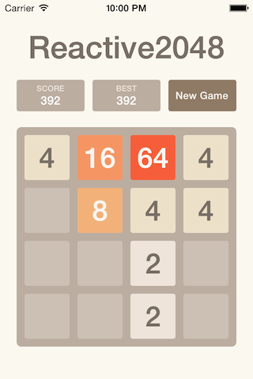
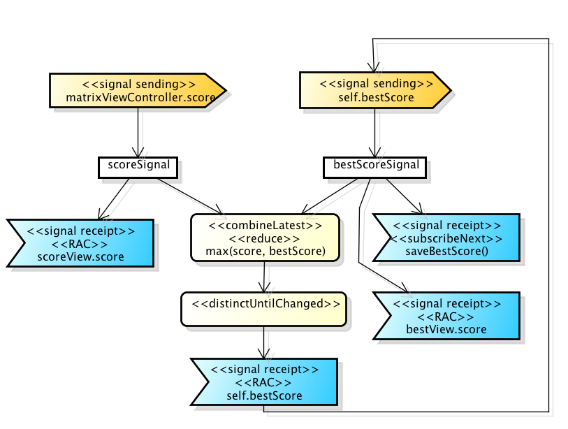
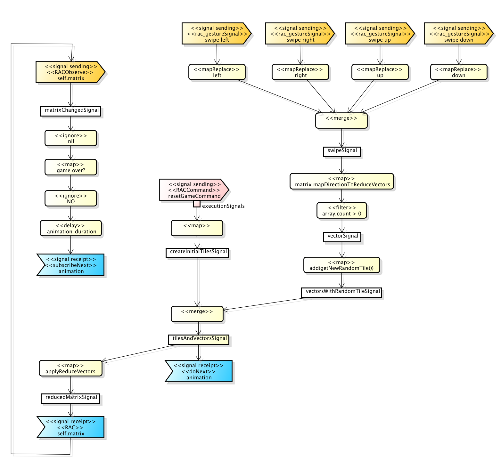

# Implement [2048](http://gabrielecirulli.github.io/2048/) in two days

Demo project which shows how we develop in Objective C at Prezi.

## Day 1 - Model
**Tags:** [TDD](http://en.wikipedia.org/wiki/Test-driven_development),
[Kiwi](https://github.com/allending/Kiwi),
[Immutable object](http://en.wikipedia.org/wiki/Immutable_object),
[DSL](http://en.wikipedia.org/wiki/Domain-specific_language),
[Blocks](https://developer.apple.com/library/ios/documentation/cocoa/Conceptual/Blocks/Articles/00_Introduction.html)

Under construction

## Day 2 - UI
**Tags:** [FRP](http://en.wikipedia.org/wiki/Functional_reactive_programming), [ReactiveCococa](https://github.com/ReactiveCocoa/ReactiveCocoa)

### Signals

RTTMainViewController:

RTTMatrixViewController:

